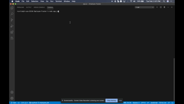

  <h1 align="center">Employee Tracker<h1>

   ## Description
  Developers are often tasked with creating interfaces that make it easy for non-developers to view and interact with information stored in databases. Often these interfaces are known as Content Management Systems. This application is used for managing a company's employees using node, inquirer, and MySQL.

  Still experiencing issues with some of the functionality with this project.  Having issues when updating certain items within database.

  

  ## Table of Contents
  - [Description](#description)
  - [Installation](#installation)
  - [Usage](#usage)
  - [License](#license)
  - [Contributing](#contributing)
  - [Tests](#tests)
  - [Questions](#questions)

  ## Usage
  * Add departments, roles, employees.
  * View departments, roles, employees.
  * Update employee roles.

  ## License
  Application is covered by the MIT License.

  ## Tests
  * Install npm packages
  * Run node app.js in terminal

  ## Contributors
  Ryan Curtin

  ## Questions
  Email me with any questions: rcurtin0491@gmail.com